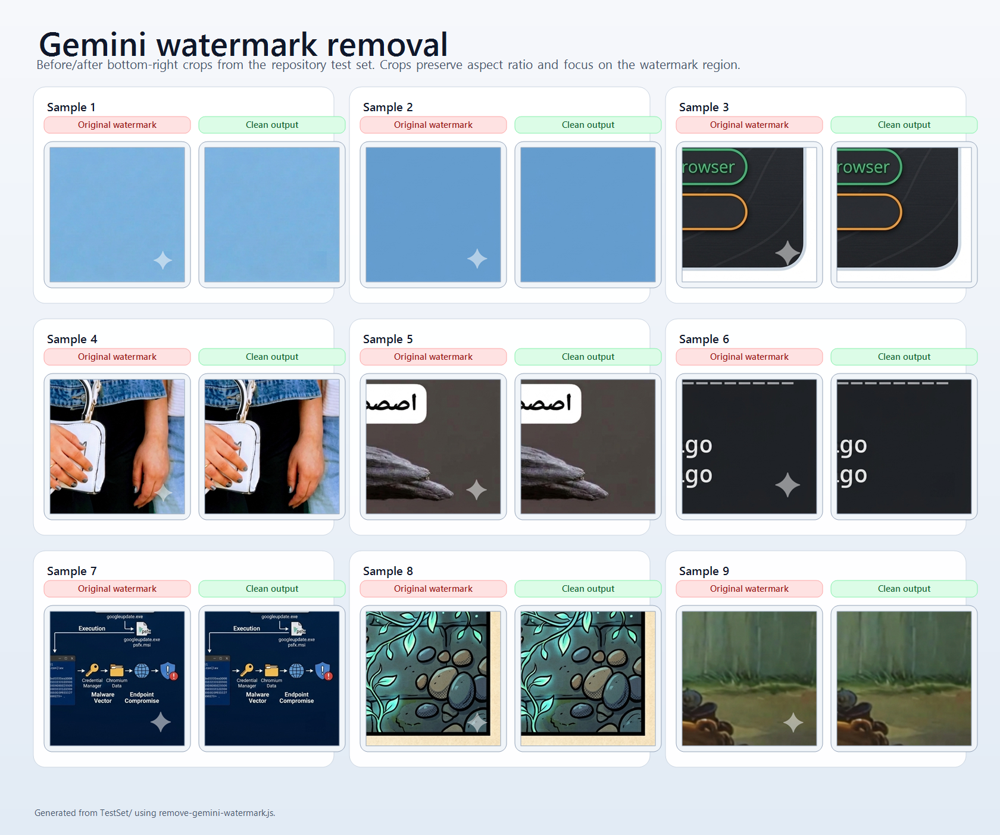

# Gemini Watermark Research Toolkit

Research-oriented Node.js tooling for detecting and removing Gemini's bottom-right sparkle watermark in PNG images.



## Why this repo exists

This repository packages a practical watermark-analysis workflow into reproducible local tooling:

- `detect-gemini-watermark.js` estimates watermark position from image structure.
- `remove-gemini-watermark.js` applies template-guided subtraction plus residual cleanup.
- `remove-gemini-watermark.userscript.js` ports the same removal logic into the browser for Gemini image flows.

The project is framed as applied research rather than a polished consumer app. The emphasis is on method clarity, observable outputs, and iteration on difficult edge cases.

## Research framing

- Scope: PNG images that contain Gemini's visible bottom-right sparkle mark.
- Method: structural matching, fixed alpha templates, heuristic fallback for default placement, and localized residual healing.
- Goal: make the pipeline understandable and editable, not hide it behind opaque binaries.
- Non-goal: universal watermark removal across arbitrary products, formats, or invisible forensic schemes.

## Quickstart

Requirements:

- Node.js 24+

Install:

```powershell
npm install
```

Detect a watermark candidate:

```powershell
node detect-gemini-watermark.js .\path\to\image.png
```

Emit machine-readable output:

```powershell
node detect-gemini-watermark.js .\path\to\image.png --json
```

Write a debug overlay:

```powershell
node detect-gemini-watermark.js .\path\to\image.png --debug .\overlay.png
```

Remove the watermark:

```powershell
node remove-gemini-watermark.js .\input.png .\outputs\cleaned.png
```

## Repository contents

- `detect-gemini-watermark.js`: CLI detector for bottom-right sparkle localization.
- `remove-gemini-watermark.js`: CLI remover with residual cleanup support.
- `remove-gemini-watermark.userscript.js`: in-browser Gemini userscript variant.
- `scripts/create-github-comparison.ps1`: rebuilds the comparison sheet when local fixture images are available.
- `docs/methodology.md`: pipeline and heuristic notes.
- `docs/research-direction.md`: current research direction and next-step questions.
- `docs/assets/watermark-removal-results.png`: GitHub-friendly before/after comparison asset.

## Reproducibility note

The evaluation fixture images used during development are not bundled in this public snapshot. That keeps the repo lighter and avoids redistributing generated/source images that may not be appropriate to publish verbatim.

If you want to rebuild the comparison asset locally, restore your private PNG fixtures under `TestSet/` and run:

```powershell
.\scripts\create-github-comparison.ps1
```

## Limitations

- The current tooling is PNG-focused.
- Detection assumes the visible Gemini sparkle appears in the bottom-right region.
- Removal quality depends on local image texture and contrast near the watermark.
- Invisible watermarking or provenance systems are outside the scope of this repo.

## Contributing

See [CONTRIBUTING.md](CONTRIBUTING.md) for guidance on bug reports, fixture handling, and research-style pull requests.

## Security

See [SECURITY.md](SECURITY.md). This is research code and should be treated accordingly.
